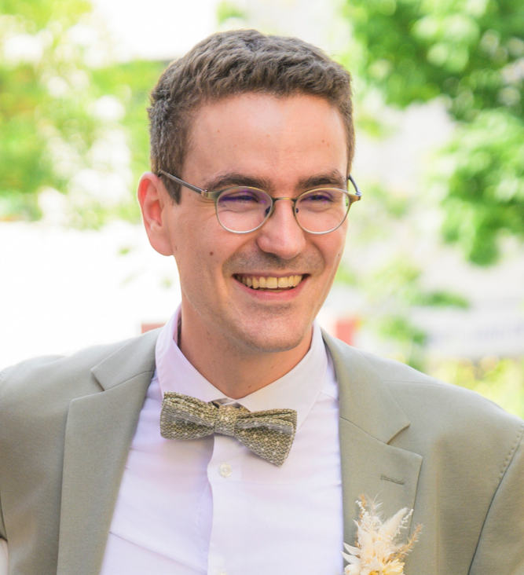

I am a currently working as a fluid mechanics process engineer in the battery/converting sector. During my physics studies I concentrated on solid state physics and nonlinear dynamics. In my doctoral studies I delved into fluid dynamics (atmospheric and weather dynamcis) as well as machine learning algorithms. During my time at the university, I found pleasure in teaching and didactics. I find that teaching is a two-way process where I continue to grow as I help others understand and apply new concepts. For this purpose I hope to create some value via the contents of this blog.
        